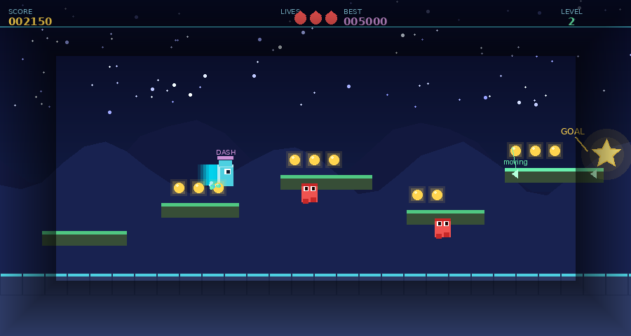

# ⭐ StarDrift — Godot 4 Portfolio Platformer

> A polished 2D side-scrolling platformer built in **Godot 4.3** to demonstrate
> professional GDScript skills, clean architecture, and modern game-feel techniques.

---

## 📸 Screenshot


*Level 2 — Player mid-jump collecting coins, patrol enemies on platforms, moving platform (right), and the star goal glowing in the distance. HUD shows score, lives, best score, and level.*

---

## 🎮 Try It Now (No Godot Needed)

Open **`stardrift_demo.html`** in any modern browser for an instant playable demo.
This is a faithful JavaScript port of the same game logic — great for showing recruiters
a live build without needing them to install Godot.

### Controls

| Action | Keys |
|---|---|
| Move left / right | `A` / `D` or `←` / `→` |
| Jump | `Space` / `W` / `↑` |
| Dash | `E` / `Shift` |
| Restart | `R` |

---

## 🏗️ Opening in Godot

### Requirements
- **Godot 4.3** — download free at [godotengine.org](https://godotengine.org)

### Steps
1. Unzip this folder.
2. Open Godot 4 → click **Import** → select `project.godot`.
3. Register the `GameManager` autoload:
   `Project → Project Settings → Autoload → add scripts/GameManager.gd → name it "GameManager"`
4. Open `scenes/Main.tscn`.
5. In the **TileMap** node, assign a TileSet and paint platforms/ground tiles.
6. Replace `PlaceholderTexture2D` sprite references with your own pixel-art sprites.
7. Press `F5` to run.

---

## 🗂️ Project Structure

```
stardrift/
├── project.godot              ← Engine config, input map, display settings
├── README.md                  ← This file
├── screenshot.png             ← In-game screenshot
├── stardrift_demo.html        ← Standalone browser-playable demo
│
├── scenes/
│   └── Main.tscn              ← Primary level scene (edit in editor)
│
└── scripts/
    ├── Player.gd              ← CharacterBody2D controller
    ├── GameManager.gd         ← Autoload singleton
    ├── Coin.gd                ← Collectible item
    ├── Enemy.gd               ← Patrol AI
    ├── MovingPlatform.gd      ← AnimatableBody2D oscillator
    ├── KillZone.gd            ← Instant-death area trigger
    ├── LevelGoal.gd           ← Level-exit star
    └── HUD.gd                 ← Signal-driven UI overlay
```

---

## ✨ Features & Techniques Demonstrated

### Player Controller (`Player.gd`)

The player uses a clean **enum-based state machine** with these states:
`IDLE → RUN → JUMP → FALL → WALL_SLIDE → DASH → DEAD`

Each frame: timers update → gravity applies → input is handled → state resolves → animation plays.

**Coyote Time** — A 120 ms grace window after walking off a ledge where the player
can still jump. This is a standard game-feel technique used in virtually every
professional platformer:

```gdscript
# If we just left the ground, start the coyote window
if was_on_floor and not is_on_floor():
    coyote_timer = COYOTE_TIME

# Allow jump if on floor OR within coyote window
var can_jump := is_on_floor() or coyote_timer > 0.0
```

**Jump Buffering** — Input is remembered for 120 ms before landing,
so pressing jump just before you touch down still works:

```gdscript
if Input.is_action_just_pressed("jump"):
    jump_buffer_timer = JUMP_BUFFER_TIME   # 0.12 s

# Consumed on next frame where can_jump is true
if jump_buffer_timer > 0.0 and can_jump:
    _do_jump()
```

**Variable Jump Height** — Releasing jump early cuts upward velocity by 55%,
giving the player precise control over arc height:

```gdscript
if Input.is_action_just_released("jump") and velocity.y < 0:
    velocity.y *= 0.45
```

**Wall Slide & Wall Jump** — Detected with `is_on_wall()`. After a wall jump,
horizontal input is locked briefly (`WALL_JUMP_LOCK_TIME = 0.18 s`) to prevent
the player immediately pushing back into the wall:

```gdscript
func _do_wall_jump() -> void:
    var wall_normal := get_wall_normal()
    velocity = Vector2(wall_normal.x * WALL_JUMP_VELOCITY.x, WALL_JUMP_VELOCITY.y)
    wall_jump_lock_timer = WALL_JUMP_LOCK_TIME
```

**Dash** — Horizontal burst with configurable duration, cooldown, and a
GPUParticles2D trail. Vertical velocity is zeroed during dash for a snappy feel:

```gdscript
func _start_dash() -> void:
    state = State.DASH
    dash_direction = Vector2(1.0 if facing_right else -1.0, 0.0)
    velocity.y = 0.0   # zero gravity during dash
    dash_trail.emitting = true
```

**Designer-Friendly Exports** — All tuning values are `@export`ed and grouped,
so a game designer can iterate from the Inspector without touching code:

```gdscript
@export_group("Jump")
@export var JUMP_VELOCITY: float    = -480.0
@export var COYOTE_TIME: float      = 0.12
@export var JUMP_BUFFER_TIME: float = 0.12

@export_group("Dash")
@export var DASH_SPEED: float    = 580.0
@export var DASH_DURATION: float = 0.18
@export var DASH_COOLDOWN: float = 0.7
```

---

### Game Manager (`GameManager.gd`)

An **Autoload singleton** — the single source of truth for all game state.
UI and gameplay systems connect to its typed signals; they never call each other directly.

```gdscript
# Typed signals — caught at compile time in Godot 4
signal score_changed(new_score: int)
signal lives_changed(new_lives: int)
signal high_score_beaten(new_high: int)
signal game_over

# High score persisted across sessions via ConfigFile
func _save() -> void:
    _config.set_value("player", "high_score", high_score)
    _config.save("user://save_data.cfg")
```

---

### Enemy AI (`Enemy.gd`)

Patrol enemies use two `RayCast2D` nodes for wall detection and a downward
physics-space query to detect ledge edges — turning around at both:

```gdscript
func _has_ground_ahead(dir: float) -> bool:
    var query := PhysicsRayQueryParameters2D.create(
        global_position + Vector2(dir * 20.0, 0),
        global_position + Vector2(dir * 20.0, 40.0),
        collision_mask
    )
    return not get_world_2d().direct_space_state.intersect_ray(query).is_empty()
```

Stomp detection separates a small `Area2D` on top of the enemy (stomp zone)
from the main body (hurt zone), avoiding ambiguous overlap checks.

---

### Moving Platforms (`MovingPlatform.gd`)

Uses `AnimatableBody2D` — Godot's built-in system for platforms that push
`CharacterBody2D` nodes. The player inherits the platform's velocity
automatically via `move_and_slide()`, with **zero extra player code**:

```gdscript
# AnimatableBody2D — Godot handles velocity transfer to riders automatically
func _physics_process(delta: float) -> void:
    var move_vec := Vector2.RIGHT if move_axis == MoveAxis.HORIZONTAL else Vector2.DOWN
    move_and_collide(move_vec * _direction * speed * delta)
```

---

### HUD (`HUD.gd`)

Fully signal-driven — the HUD connects to `GameManager` on `_ready()` and
reacts to changes without polling or coupling to any gameplay node:

```gdscript
func _ready() -> void:
    GameManager.score_changed.connect(_update_score)
    GameManager.lives_changed.connect(_update_lives)
    GameManager.high_score_beaten.connect(_show_high_score_banner)
```

---

## 🔧 Extending the Game

**Add a new level**
Duplicate `Main.tscn`, repaint the TileMap, and set `LevelGoal.next_scene`
to the new file path. `GameManager.advance_level()` handles all state.

**Add a new enemy type**
Extend `Enemy.gd` or create a new `CharacterBody2D` script.
The separate stomp/hurt `Area2D` pattern is fully reusable.

**Add a new player ability**
1. Add a value to the `State` enum in `Player.gd`.
2. Handle the input trigger in `_handle_input()`.
3. Apply physics in `_apply_gravity()` or `_update_state()`.
4. Play the matching animation in `_update_animation()`.

---

## 📄 License

MIT — free to use as a portfolio sample, learning resource, or project starter.
